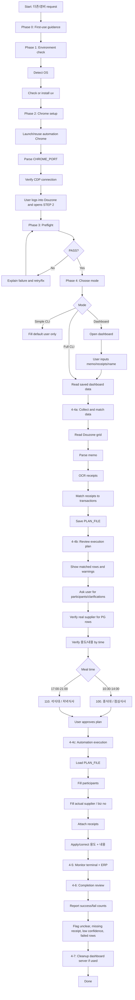

# Douzonebot Workflow

```mermaid
flowchart TD
    A["Start: 더존/경비 request"] --> B["Phase 0: First-use guidance"]
    B --> C["Phase 1: Environment check"]
    C --> C1["Detect OS"]
    C1 --> C2["Check or install uv"]
    C2 --> D["Phase 2: Chrome setup"]
    D --> D1["Launch/reuse automation Chrome"]
    D1 --> D2["Parse CHROME_PORT"]
    D2 --> D3["Verify CDP connection"]
    D3 --> E["User logs into Douzone and opens STEP 2"]

    E --> F["Phase 3: Preflight"]
    F --> F1{"PASS?"}
    F1 -- "No" --> F2["Explain failure and retry/fix"]
    F2 --> F
    F1 -- "Yes" --> G["Phase 4: Choose mode"]

    G --> H{"Mode"}
    H -- "Simple CLI" --> I["Fill default user only"]
    H -- "Dashboard" --> J["Open dashboard"]
    J --> J1["User inputs memo/receipts/name"]
    J1 --> K["Read saved dashboard data"]
    H -- "Full CLI" --> K

    K --> L["4-4a: Collect and match data"]
    L --> L1["Read Douzone grid"]
    L1 --> L2["Parse memo"]
    L2 --> L3["OCR receipts"]
    L3 --> L4["Match receipts to transactions"]
    L4 --> M["Save PLAN_FILE"]

    M --> N["4-4b: Review execution plan"]
    N --> N1["Show matched rows and warnings"]
    N1 --> N2["Ask user for participants/clarifications"]
    N2 --> N3["Verify real supplier for PG rows"]
    N3 --> N4["Verify 용도/내용 by time"]
    N4 --> N5{"Meal time"}
    N5 -- "10:30-14:00" --> N6["100. 중식대 / 점심식사"]
    N5 -- "17:00-21:00" --> N7["110. 석식대 / 저녁식사"]
    N6 --> O["User approves plan"]
    N7 --> O

    O --> P["4-4c: Automation execution"]
    P --> P1["Load PLAN_FILE"]
    P1 --> P2["Fill participants"]
    P2 --> P3["Fill actual supplier / biz no"]
    P3 --> P4["Attach receipts"]
    P4 --> P5["Apply/correct 용도 + 내용"]

    P5 --> Q["4-5: Monitor terminal + ERP"]
    Q --> R["4-6: Completion review"]
    R --> R1["Report success/fail counts"]
    R1 --> R2["Flag unclear, missing receipt, low confidence, failed rows"]
    R2 --> S["4-7: Cleanup dashboard server if used"]
    S --> T["Done"]
```

